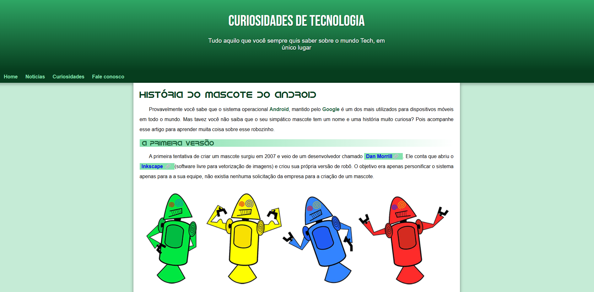

# Projeto Android

Projeto desenvolvido durante o módulo 2 do curso de HTML e CSS do Curso em Vídeo, com foco em semântica, responsividade e boas práticas de estilização.

## ✨ Sobre o projeto

O projeto consiste em uma página sobre a história do mascote do Android, explorando recursos importantes do desenvolvimento Front-End, como:

- Estrutura semântica em HTML5
- Responsividade para diferentes dispositivos
- Uso de imagens adaptativas com `<picture>`
- Variáveis em CSS
- Organização e composição de layout
- Incorporação de vídeo com iframe

## 🛠️ Tecnologias utilizadas

- HTML5
- CSS3

## 📷 Preview

## 🔗 Acesse o projeto

[Clique aqui para visualizar](https://nataliarodriguesz.github.io/frontend-estudos/projetos/projeto-android/)

---

Desenvolvido durante meus estudos de Front-End.