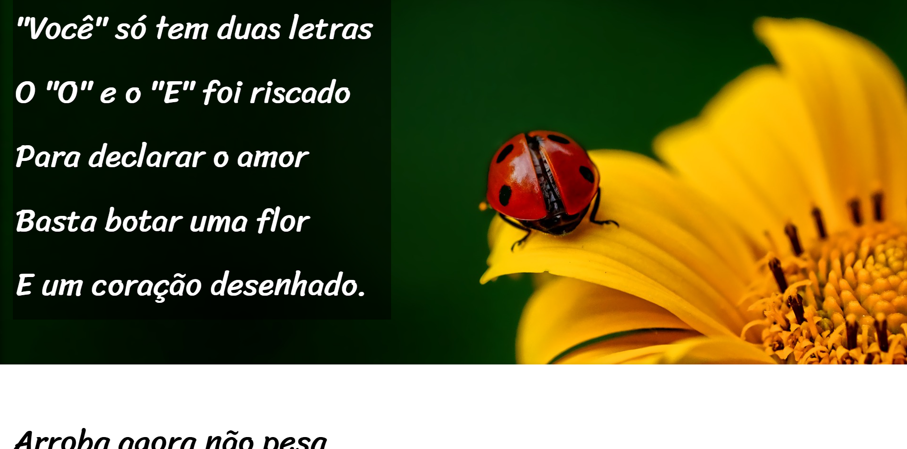

# Projeto Cordel

Projeto desenvolvido durante o módulo 3 do curso de HTML e CSS do Curso em Vídeo, com foco em efeitos visuais, tipografia e efeito parallax.

## ✨ Sobre o projeto

O projeto apresenta o poema *Cordel Moderno*, de Milton Duarte, utilizando uma proposta visual inspirada na literatura de cordel e explorando recursos importantes do desenvolvimento Front-End, como:

- Estrutura semântica em HTML5
- Efeito parallax com `background-attachment: fixed`
- Tipografia personalizada com Google Fonts
- Responsividade para diferentes dispositivos
- Organização visual com seções alternadas
- Estilização moderna com CSS3

## 🛠️ Tecnologias utilizadas

- HTML5
- CSS3

## 📷 Preview

## 🔗 Acesse o projeto

[Clique aqui para visualizar](https://nataliarodriguesz.github.io/frontend-estudos/projetos/projeto-cordel/)

---

Desenvolvido durante meus estudos de Front-End.