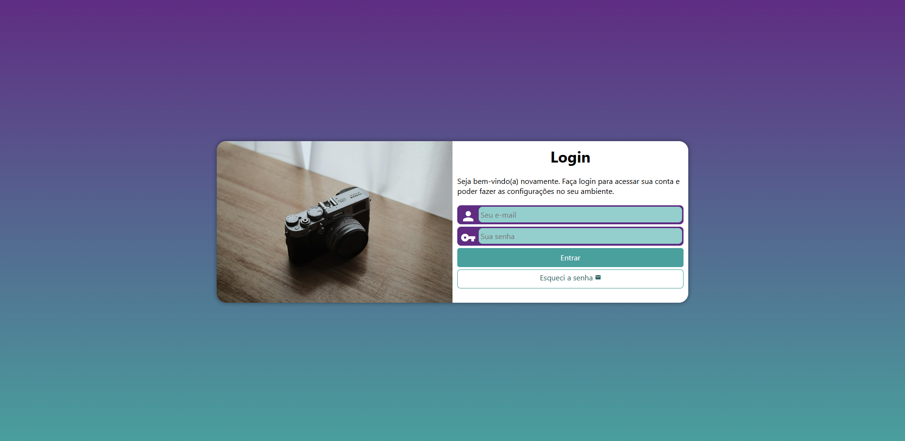

# Projeto Login

Projeto desenvolvido durante o módulo 4 do curso de HTML e CSS do Curso em Vídeo, utilizando a abordagem Mobile First e focando em responsividade, formulários e media queries.

## ✨ Sobre o projeto

O projeto consiste em uma tela de login moderna e responsiva, explorando conceitos importantes do desenvolvimento Front-End, como:

- Estrutura semântica em HTML5
- Desenvolvimento utilizando Mobile First
- Formulários e validações de campos
- Responsividade para diferentes dispositivos
- Uso de media queries
- Layout adaptável para tablet e desktop
- Integração com Material Icons
- Estilização moderna com CSS3

## 🛠️ Tecnologias utilizadas

- HTML5
- CSS3

## 📷 Preview

## 🔗 Acesse o projeto

[Clique aqui para visualizar](https://nataliarodriguesz.github.io/frontend-estudos/projetos/projeto-login/)

---

Desenvolvido durante meus estudos de Front-End.