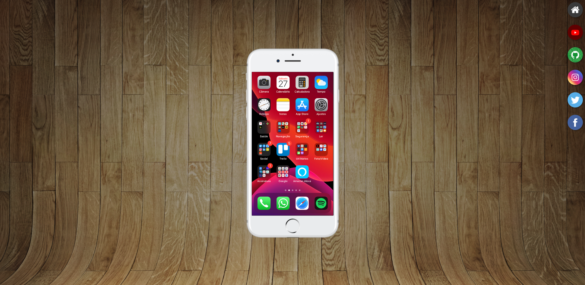

# Projeto Redes Sociais

Projeto desenvolvido durante o módulo 4 do curso de HTML e CSS do Curso em Vídeo, com foco em responsividade, navegação interativa e simulação de interface mobile utilizando `iframe`.

## ✨ Sobre o projeto

O projeto simula um smartphone exibindo diferentes redes sociais dentro da tela do aparelho, permitindo navegar entre páginas através de ícones laterais interativos.

Durante o desenvolvimento foram explorados conceitos importantes do Front-End, como:

- Estrutura semântica em HTML5
- Posicionamento com CSS
- Uso de `iframe` para navegação dinâmica
- Responsividade e adaptação visual
- Efeitos de hover e transições suaves
- Organização visual inspirada em interfaces mobile
- Estilização moderna com CSS3

## 🛠️ Tecnologias utilizadas

- HTML5
- CSS3

## 📱 Funcionalidades

- Simulação de smartphone na tela
- Navegação entre páginas dentro do `iframe`
- Ícones interativos de redes sociais
- Efeitos visuais ao passar o mouse
- Layout centralizado e responsivo

## 📷 Preview

## 🔗 Acesse o projeto

[Clique aqui para visualizar](https://nataliarodriguesz.github.io/frontend-estudos/projetos/projeto-redes-sociais/)

---

Desenvolvido durante meus estudos de Front-End no Curso em Vídeo.